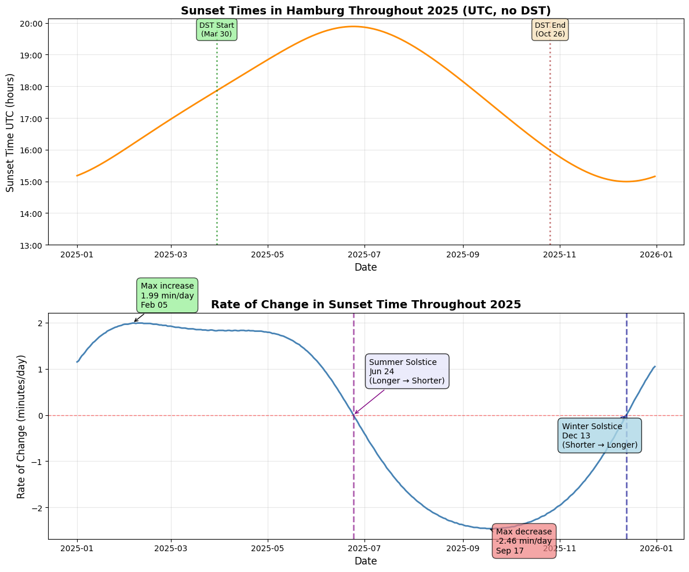

# Sunset Time Analysis and Seasonal Change Detection

This project computes and visualizes daily sunset times for a given location and year using precise astronomical calculations using the **astral package** (https://astral.readthedocs.io/en/latest/index.html).
It also derives the **rate of change of sunset time** to identify seasonal turning points such as the solstices.

---

## Features

- Computes daily sunset times using the **Astral** astronomy library  
- Correct handling of time zones and daylight saving transitions  
 - Calculates daily rate of change in sunset time (minutes/day)  
- Automatically identifies:
  - Summer solstice (latest sunset)
  - Winter solstice (earliest sunset)
- Produces clear, publication-quality plots using Matplotlib  

---

## Installation

This project uses **uv** for fast, reproducible dependency management. See https://docs.astral.sh/uv/

```bash
# On macOS and Linux.
curl -LsSf https://astral.sh/uv/install.sh | sh

# On Windows.
powershell -ExecutionPolicy ByPass -c "irm https://astral.sh/uv/install.ps1 | iex"

uv venv #Create and activate a virtual environment
uv sync #install dependencies
```


## Example Usage

```python
import matplotlib.pyplot as plt
from datetime import datetime
import numpy as np
import pandas as pd
from main import  get_sunset_hours, get_derivative, plot_sunset_analysis

sunset_data = get_sunset_hours(city="Hamburg",
                               region="Germany",
                                timezone="Europe/Berlin",
                                latitude=53.5511,
                                longitude=9.9937,
                                year=2025)
                                
# Calculate derivatives - pass the sunset_hours column as a list
derivatives = get_derivative(sunset_data["sunset_hours"].tolist())

# Create plots with DST (dates when time is changed from summer to winter time and vice versa) markers
dst_spring = datetime(2025, 3, 30)
dst_fall = datetime(2025, 10, 26)

plot_sunset_analysis(sunset_data, derivatives, dst_spring, dst_fall)
```




=== Sunset Time Statistics for Hamburg 2025 ===

Earliest sunset: 15:59 (local) / 14:59 UTC on December 13
Latest sunset: 21:53 (local) / 19:53 UTC on June 24

Maximum rate of increase: 1.99 minutes/day on February 05
Maximum rate of decrease: -2.46 minutes/day on September 17

*** Winter Solstice (shorter → longer days): December 13, 2025 ***
    This is the shortest day of the year

*** Summer Solstice (longer → shorter days): June 24, 2025 ***
    This is the longest day of the yea
